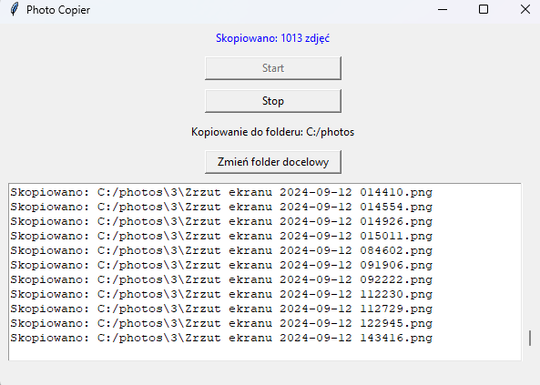

# Photos Copier

**Program that allows you to copy images from a selected source folder to a target folder with contains max 500 photos in each folder. The program checks for duplicates using MD5 hash sums to ensure only unique images are copied into folders. .**


## Features

- Select a source folder from which images will be copied.
- Select a target folder where the images will be saved.
- Automatically create new folders in the target folder if any folder contains fewer than 500 images.
- Duplicate check using MD5 hash sum.
- Graphical user interface to manage the copying process.

## Run python
- ```py copier.py```


## Create exe
 ```pyinstaller --onefile --windowed copier.py``` or 
 ```python -m PyInstaller --onefile --windowed copier.py```

if you do not have pyinstaller:
```pip install pyinstaller```